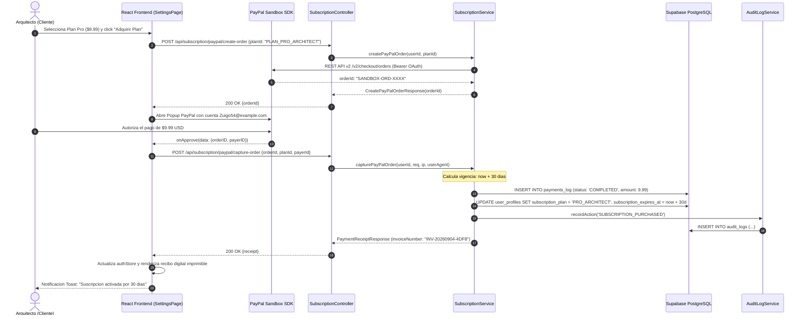
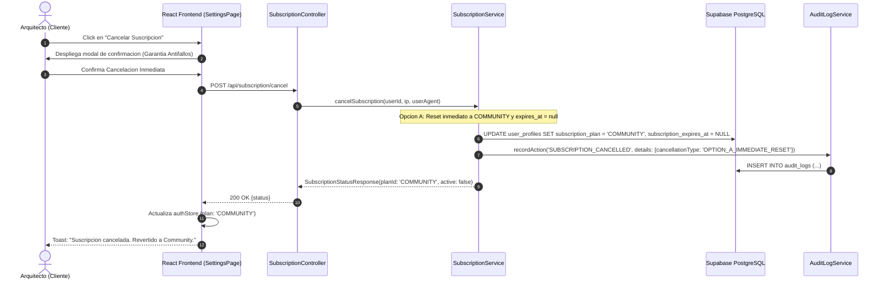
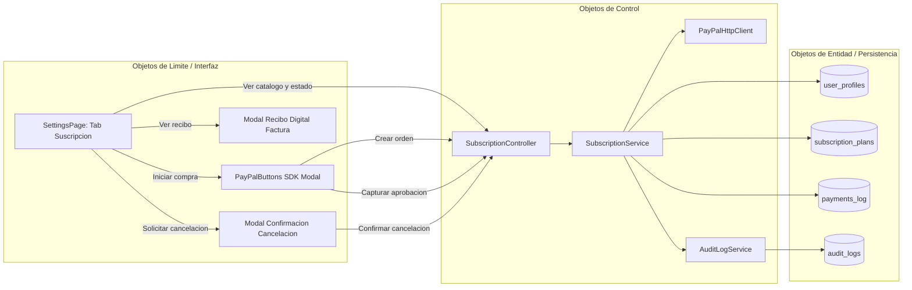

# DOCUMENTACION DEL PROYECTO — CASE Tool Colaborativo con IA

> **Materia**: Ingenieria de Software 1 (SW1)  
> **Proyecto**: Herramienta CASE Colaborativa con Inteligencia Artificial  
> **Fecha de entrega**: 21 de septiembre de 2026  

---

## PARTE 1: FUNDAMENTACION TEORICA

### 1.1 Ingenieria de Software Asistida por Computadora (CASE)

#### Que es CASE?
Las herramientas CASE (Computer-Aided Software Engineering) son aplicaciones de software que proporcionan soporte automatizado para actividades del proceso de desarrollo de software. Estas herramientas mejoran la **productividad** del desarrollador al automatizar tareas repetitivas, verificar la consistencia del diseno y facilitar la documentacion.

#### Clasificacion de herramientas CASE
- **Upper CASE**: Soporte para las fases de analisis y diseno (diagramas UML, modelado de datos)
- **Lower CASE**: Soporte para implementacion, pruebas y mantenimiento (generadores de codigo, depuradores)
- **Integrated CASE (I-CASE)**: Cubren todo el ciclo de vida del software

#### Nuestra herramienta
Este proyecto implementa una herramienta **I-CASE** que cubre desde el diseno (diagramas de clases UML) hasta la implementacion (generacion de codigo Spring Boot) y pruebas (colecciones Postman).

**Productividad que aporta:**
- Eliminacion de codificacion manual repetitiva
- Generacion automatica de las 4 capas de Spring Boot (Entity, Repository, Service, Controller)
- Reduccion de errores humanos en el mapeo diagrama a codigo
- Colaboracion en tiempo real que elimina conflictos de versiones

---

### 1.2 Desarrollo de Software Basado en Componentes (CBD)

- **Arquitectura Modular**: Frontend desacoplado con componentes reactivos independientes en React 18 y TypeScript.
- **Microservicios y Modulos Backend**: Division limpia de responsabilidades (Seguridad JWT, Administracion RBAC, Motor de Suscripciones y Facturacion PayPal, Diseno CASE UML).
- **Interoperabilidad**: Interfaces estandarizadas REST JSON con contratos inmutables DTO.

---

### 1.3 Arquitectura de Software

- **Patron Arquitectonico**: Cliente-Servidor Desacoplado con Single Page Application (SPA) y Backend RESTful en Spring Boot 4.1.0.
- **Persistencia**: PostgreSQL 17 relacional en Supabase con soporte de tipos JSONB para cargas raw de pasarelas de pago y esquemas dinamicos UML.
- **Seguridad**: Token Bearer JWT volatil en sessionStorage (sin cookies vulnerables a CSRF), filtros de seguridad stateless `OncePerRequestFilter`, control de acceso basado en roles (RBAC: `SUPER_ADMIN`, `ARQUITECTO`, `COLABORADOR`) y auditoria de seguridad inmutable en tabla `audit_logs`.

---

## PARTE 2: REGISTROS DEL PROCESO DE DESARROLLO UNIFICADO (PUDS)

### 2.1 Catalogo de Casos de Uso Implementados

| Caso de Uso | Nombre Comercial | Actor Principal | Descripcion Sintetica |
|---|---|---|---|
| **CU01** | Autenticacion y Perfil de Usuario | Usuario / Arquitecto | Registro, inicio de sesion seguro con JWT volatil, actualizacion de credenciales y eliminacion en 2 pasos. |
| **CU02** | Gobernanza RBAC y Auditoria | Super Administrador | Gestion de usuarios de plataforma, alternancia de estado activo/inactivo, asignacion de roles y registro inmutable de auditoria. |
| **CU03** | Suscripcion SaaS y Facturacion (30 Dias) | Arquitecto / Equipo | Compra y renovacion de plan por 30 dias mediante PayPal Sandbox oficial, emision de factura fiscal imprimible y cancelacion inmediata (Opcion A). |

---

### 2.2 Especificacion Detallada del CU03: Suscripcion SaaS (30 Dias con PayPal Sandbox)

#### 2.2.1 Proposito y Alcance
Permitir a los arquitectos de software adquirir o renovar licencias de uso avanzado (Plan Pro Architect $9.99 USD / 30 dias o Plan Enterprise Team $29.99 USD / 30 dias) mediante la pasarela certificada **PayPal Sandbox**, asegurando:
1. Una vigencia exacta de 30 dias calendario.
2. Persistencia inmutable del pago en la tabla `payments_log` con payload transaccional completo.
3. Actualizacion del rol y plan en `user_profiles`.
4. Registro del evento de auditoria `SUBSCRIPTION_PURCHASED`.
5. Emision de recibo fiscal digital con formato `INV-YYYYMMDD-XXXX` y vista de impresion.
6. **Modulo de Cancelacion con Garantia Antifallos (Opcion A)**: Reversion inmediata al plan `COMMUNITY`, limpieza de fecha de expiracion a `null` y registro de auditoria `SUBSCRIPTION_CANCELLED`, permitiendo al usuario volver a comprar y probar de forma ilimitada sin inconsistencias en la base de datos.

#### 2.2.2 Diagrama de Secuencia UML (Compra de Suscripcion 30 Dias)

#### 2.2.3 Diagrama de Secuencia UML (Cancelacion Inmediata — Opcion A)

#### 2.2.4 Diagrama de Robustez (Analisis PUDS)

---

## PARTE 3: GUIA DE VERIFICACION PAYPAL SANDBOX

Para ejecutar pruebas del flujo completo de compra y facturacion:
1. **Credenciales del Comercio (Merchant Receptor)**:
   - Cuenta Comercio: `Lis54@example.com`
   - Client ID: `BAAEZt0Yfq-bOz9gNms5brjPxsI5rg76weuPR4Af4MdDP5g5XkLEMd9FOfZppWGz2g1q-3CeacCFe4Pc-w`
2. **Credenciales del Comprador (Personal Buyer)**:
   - Correo Comprador: `Zuigo54@example.com`
3. **Flujo de Prueba**:
   - Iniciar sesion como Arquitecto.
   - Ir a la pestana **Suscripcion y Facturacion** en `/settings?tab=subscription`.
   - Seleccionar **Pro Architect** o **Enterprise Team**.
   - Completar el pago con el boton oficial PayPal o el boton de bypass de pruebas directas Sandbox.
   - Observar el contador de 30 dias y la barra de progreso activa.
   - Presionar **Ver Factura** para visualizar e imprimir el recibo digital oficial.
   - Presionar **Cancelar Suscripcion** para verificar la reversion limpia a `COMMUNITY`.
