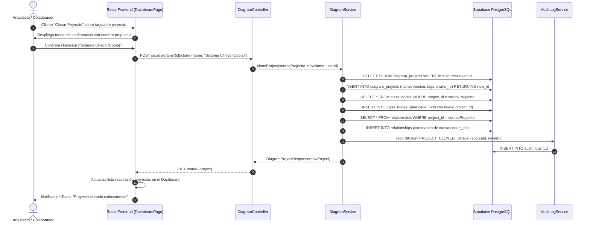
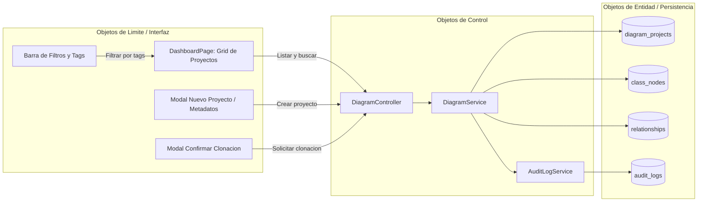

# DOCUMENTACION DEL PROYECTO — CASE Tool Colaborativo con IA

> **Materia**: Ingenieria de Software 1 (SW1)  
> **Proyecto**: Herramienta CASE Colaborativa con Inteligencia Artificial  
> **Fecha de entrega**: 21 de septiembre de 2026  

---

## PARTE 1: FUNDAMENTACION TEORICA

### 1.1 Ingenieria de Software Asistida por Computadora (CASE)

#### Que es CASE?
Las herramientas CASE (Computer-Aided Software Engineering) son aplicaciones de software que proporcionan soporte automatizado para actividades del proceso de desarrollo de software. Estas herramientas mejoran la **productividad** del desarrollador al automatizar tareas repetitivas, verificar la consistencia del diseno y facilitar la documentacion.

#### Clasificacion de herramientas CASE
- **Upper CASE**: Soporte para las fases de analisis y diseno (diagramas UML, modelado de datos)
- **Lower CASE**: Soporte para implementacion, pruebas y mantenimiento (generadores de codigo, depuradores)
- **Integrated CASE (I-CASE)**: Cubren todo el ciclo de vida del software

#### Nuestra herramienta
Este proyecto implementa una herramienta **I-CASE** que cubre desde el diseno (diagramas de clases UML) hasta la implementacion (generacion de codigo Spring Boot) y pruebas (colecciones Postman).

**Productividad que aporta:**
- Eliminacion de codificacion manual repetitiva
- Generacion automatica de las 4 capas de Spring Boot (Entity, Repository, Service, Controller)
- Reduccion de errores humanos en el mapeo diagrama a codigo
- Colaboracion en tiempo real que elimina conflictos de versiones

---

### 1.2 Desarrollo de Software Basado en Componentes (CBD)

- **Arquitectura Modular**: Frontend desacoplado con componentes reactivos independientes en React 18 y TypeScript.
- **Microservicios y Modulos Backend**: Division limpia de responsabilidades (Seguridad JWT, Administracion RBAC, Gestion de Proyectos y Espacios de Trabajo, Diseno CASE UML).
- **Interoperabilidad**: Interfaces estandarizadas REST JSON con contratos inmutables DTO.

---

### 1.3 Arquitectura de Software

- **Patron Arquitectonico**: Cliente-Servidor Desacoplado con Single Page Application (SPA) y Backend RESTful en Spring Boot 4.1.0.
- **Persistencia**: PostgreSQL 17 relacional en Supabase con soporte de tipos JSONB para cargas raw de pasarelas de pago y esquemas dinamicos UML.
- **Seguridad**: Token Bearer JWT volatil en sessionStorage (sin cookies vulnerables a CSRF), filtros de seguridad stateless `OncePerRequestFilter`, control de acceso basado en roles (RBAC: `SUPER_ADMIN`, `ARQUITECTO`, `COLABORADOR`) y auditoria de seguridad inmutable en tabla `audit_logs`.

---

## PARTE 2: REGISTROS DEL PROCESO DE DESARROLLO UNIFICADO (PUDS)

### 2.1 Catalogo de Casos de Uso Implementados

| Caso de Uso | Nombre Comercial | Actor Principal | Descripcion Sintetica |
|---|---|---|---|
| **CU01** | Autenticacion y Perfil de Usuario | Usuario / Arquitecto | Registro, inicio de sesion seguro con JWT volatil, actualizacion de credenciales, preferencias de canvas y eliminacion en 2 pasos. |
| **CU02** | Gobernanza RBAC y Auditoria | Super Administrador | Gestion de usuarios de plataforma, alternancia de estado activo/inactivo, asignacion de roles y registro inmutable de auditoria. |
| **CU03** | Gestion de Proyectos y Espacios de Trabajo | Arquitecto / Colaborador | Creacion de proyectos desde cero, edicion de metadatos (version semantica, tags), busqueda reactiva y clonacion integra de proyectos con su grafo de clases y relaciones. |
| **CU11** | Exportacion de Modelo y Documentacion Tecnica | Arquitecto / Colaborador | Exportacion estandar OMG XMI 2.1 (ArchiTec / StarUML), renderizado PNG, memoria tecnica PDF y diccionario de datos en Excel (.xlsx) con tipos de datos por columna. |

---

### 2.2 Especificacion Detallada del CU03: Gestion de Proyectos y Espacios de Trabajo (CRUD y Clonacion)

#### 2.2.1 Proposito y Alcance
Permitir a los arquitectos de software y colaboradores gestionar el ciclo de vida de sus diagramas UML directamente en el Dashboard:
1. Creacion de proyectos en blanco con metadatos personalizados (titulo, descripcion, autor, version semantica inicial `v1.0.0` y etiquetas/tags de dominio).
2. Edicion de propiedades y actualizacion de metadatos.
3. **Clonacion / Duplicacion Integra de Proyectos**: Duplica un proyecto existente creando una copia exacta de todos sus nodos de clases (`class_nodes`) y relaciones (`relationships`) con sufijo ` (Copia)`, permitiendo bifurcaciones de arquitectura o ensayos sin alterar el modelo original.
4. Busqueda reactiva por texto y filtrado por categorias/etiquetas.
5. Eliminacion logica segura con confirmacion (`is_deleted = true`).

#### 2.2.2 Diagrama de Secuencia UML (Clonacion de Proyecto)

#### 2.2.3 Diagrama de Robustez (Analisis PUDS — CU03)

---

### 2.3 Especificacion Detallada del CU11: Exportacion de Modelo y Documentacion Tecnica

#### 2.3.1 Formatos de Exportacion Estandarizados
1. **XMI 2.1 (OMG para ArchiTec / StarUML)**: Serializacion formal del metamodelo UML en XML estructurado.
2. **Imagen Grafica PNG**: Renderizado vectorial exportado en mapa de bits de alta resolucion (escala 2x).
3. **Memoria Tecnica PDF**: Informe ejecutivo formal que incluye caratula, ficha del proyecto, imagen incrustada del diagrama y matriz de clases.
4. **Diccionario de Datos en Excel (.xlsx)**: Hoja de calculo estructurada mediante Apache POI con el inventario detallado de tablas, atributos, tipos de datos SQL (PostgreSQL 17), tipos Java, modificadores de visibilidad, llaves primarias (PK), llaves foraneas (FK) y cardinalidades.
